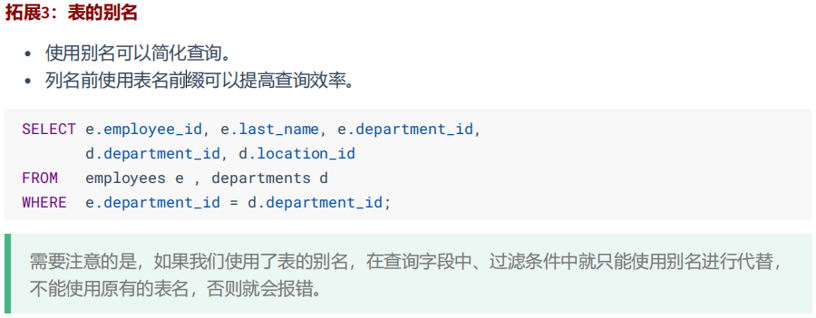

# MySQL
## 1.库的基本操作
### 1.1 创建库
```sql
create database 数据库名;

#创建atguigudb数据库，该名称不能与已经存在的数据库重名。
create database atguigudb;
```
### 1.2 使用库
```sql
use 数据库名;
#使用atguigudb数据库
use atguigudb;
```
>说明：如果没有使用use语句，后面针对数据库的操作也没有加“数据名”的限定，那么会报“ERROR 1046
(3D000): No database selected”（没有选择数据库）
> 
>使用完use语句之后，如果接下来的SQL都是针对一个数据库操作的，那就不用重复use了，如果要针对另
一个数据库操作，那么要重新use。
### 1.3 删除库
```sql
drop databases [if exists] 库名;
```
### 1.4 查看某个库的所有表格
```sql
show tables from 数据库名;
```

## 2.表管理
### 2.1 创建表
```sql
create table 表名称(
       字段名 数据类型,
       字段名 数据类型
);
```
> 说明：如果是最后一个字段，后面就用加逗号，因为逗号的作用是分割每个字段。
```sql
#创建学生表
CREATE TABLE student (
    `id` INT,
    `name` VARCHAR(20) -- 说名字最长不超过20个字符
);
```
### 2.2 查看一个表的数据
```sql
select * from 数据库表名称;

--查看学生表的数据
select * from student;
```
### 2.3 添加一条记录
```sql
insert into 表名称 values(值列表);

--添加两条记录到student表中
insert into student values(1,'张三');
insert into student values(2,'李四');
```
### 2.4 查看表的创建信息
```sql
show create table 表名称

--查看student表的详细创建信息
show create table student
```
```sql
CREATE TABLE `student` (
  `id` int DEFAULT NULL,
  `name` varchar(20) DEFAULT NULL
) ENGINE=InnoDB DEFAULT CHARSET=utf8mb3
```

### 2.5 删除表格
```sql
drop table 表名称;

--删除学生表
drop table student;
```
## 3.基本的 SELECT 语句
### 3.1 SELECT ... FROM
```sql
SELECT 标识选择哪些列
FROM 标识从哪个表中选择
```
```sql
SELECT *
FROM departments;
```
> 一般情况下，除非需要使用表中所有的字段数据，最好不要使用通配符‘*’。使用通配符虽然可以节省输入查询语句的时间，但是获取不需要的列数据通常会降低查询和所使用的应用程序的效率。通配符的优势是，当不知道所需要的列的名称时，可以通过它获取它们。在生产环境下，不推荐你直接使用 SELECT * 进行查询。

### 3.2 选定特定的列
```sql
SELECT department_id, location_id
FROM departments;
```


### 3.3 列的别名


### 3.4 去除重复行
默认情况下，查询会返回全部行，包括重复行


### 3.5 空值参与运算


### 3.6 着重号
我们需要保证表中的字段、表名等没有和保留字、数据库系统或常用方法冲突。如果真的相同，请在
SQL语句中使用一对``（着重号）引起来。

## 4.显示表结构
使用DESCRIBE 或 DESC 命令，表示表结构。
```sql
DESCRIBE employees;
或
DESC employees;
```


## 5.算术运算符

### 5.1 比较运算符
比较运算符用来对表达式左边的操作数和右边的操作数进行比较，比较的结果为真则返回1，比较的结果
为假则返回0，其他情况则返回NULL。
比较运算符经常被用来作为SELECT查询语句的条件来使用，返回符合条件的结果记录。


## 6.逻辑运算符


## 7.排序与分页
### 1.排序
#### 1.1排序数据

#### 1.2单列排序
```sql
select last_name,job_id,department_id,hire_date
from employees
order by hire_date;
```

```sql
select last_name,job_id,department_id,hire_date
from employees
order by hire_date desc;
```

#### 1.3多列排序
```sql
SELECT last_name,department_id,salary
FROM employees
ORDER BY department_id,salary DESC;
```


### 2.分页
#### 2.1背景

#### 2.2 实现规则

```sql
-- 前10条记录
SELECT * FROM employees LIMIT 0,10;
-- 或者
SELECT * FROM employees LIMIT 10;
```

```sql
-- 第11至20条记录
SELECT * FROM employees LIMIT 10,10;
```


```sql
-- 第21至30条记录
SELECT * FROM employees LIMIT 20,10;
```


#### 2.3 扩展


## 8.多表查询
多表查询，也称为关联查询，指两个或更多个表一起完成查询操作。

前提条件：这些一起查询的表之间是有关系的（一对一、一对多），它们之间一定是有关联字段，这个关联字段可能建立了外键，也可能没有建立外键。比如：员工表和部门表，这两个表依靠“部门编号”进行关联。

### 1.一个案例引发的多表连接
#### 1.1 案例说明

从多个表中获取数据：

#### 1.2 笛卡尔积（交叉连接）的理解


```sql
-- 查询员工姓名和所在部门名称
SELECT last_name,department_name FROM employees,departments;
SELECT last_name,department_name FROM employees CROSS JOIN departments;
SELECT last_name,department_name FROM employees INNER JOIN departments;
SELECT last_name,department_name FROM employees JOIN departments;
```
#### 1.3 案例分析与问题解决

```sql
SELECT table1.column, table2.column
FROM table1, table2
WHERE table1.column1 = table2.column2; -- 连接条件
```


### 2.多表查询的分类讲解
#### 分类1：等值连接 vs 非等值连接
##### 等值连接

```sql
SELECT
	employees.employee_id,
	employees.last_name,
	employees.department_id,
	departments.department_id,
	departments.location_id 
FROM
	employees,departments 
WHERE employees.department_id = departments.department_id;
```





```sql
-- 练习：查询出公司员工的 last_name,department_name, city
SELECT e.last_name,d.department_name,l.city
FROM employees e,departments d,locations l
WHERE e.department_id = d.department_id AND d.location_id = l.location_id;
```


#### 非等值连接

```sql
SELECT e.last_name,e.salary,j.grade_level
FROM employees e,job_grades j
WHERE e.salary BETWEEN j.lowest_sal AND j.highest_sal;
```

#### 分类2：自连接 vs 非自连接

题目：查询employees表，返回“Xxx works for Xxx”
```sql
SELECT CONCAT(worker.last_name,' worker for ',manager.last_name)
FROM employees worker, employees manager
WHERE worker.manager_id = manager.employee_id;
```

```sql
-- 练习：查询出last_name为 ‘Chen’ 的员工的 manager 的信息。
SELECT e.employee_id,e.first_name,e.last_name,d.department_id,d.department_name,e.salary,l.city
FROM employees e,departments d,locations l
WHERE e.department_id = d.department_id AND d.location_id = l.location_id AND e.last_name LIKE 'Chen';
```


#### 分类3：内连接 vs 外连接
除了查询满足条件的记录以外，外连接还可以查询某一方不满足条件的记录。


### 3.SQL99语法实现多表查询
#### 3.1 基本语法
+ 使用 JOIN...ON子句创建连接的语法结构
```sql
SELECT table1.column, table2.column,table3.column
FROM table1
    JOIN table2 ON table1 和 table2 的连接条件
        JOIN table3 ON table2 和 table3 的连接条件
```
它的嵌套逻辑类似我们使用的 FOR 循环：
```java
for t1 in table1:
    for t2 in table2:
        if condition1:
            for t3 in table3:
                if condition2:
                    output t1 + t2 + t3
```
SQL99 采用的这种嵌套结构非常清爽、层次性更强、可读性更强，即使再多的表进行连接也都清晰可见。如果你采用 SQL92，可读性就会大打折扣。


#### 3.2 内连接(INNER JOIN)的实现

```sql
SELECT e.employee_id, e.last_name, e.department_id, d.department_id, d.location_id
FROM employees e JOIN departments d
ON (e.department_id = d.department_id);
```

```sql
SELECT employee_id, city, department_name
FROM employees e
JOIN departments d
ON d.department_id = e.department_id
JOIN locations l
ON d.location_id = l.location_id;
```


#### 3.3 外连接(OUTER JOIN)的实现
##### 3.3.1 左外连接(LEFT OUTER JOIN)

```sql
SELECT e.last_name, e.department_id, d.department_name
FROM employees e
LEFT OUTER JOIN departments d
ON (e.department_id = d.department_id);
```


##### 3.3.2 右外连接(RIGHT OUTER JOIN)

```sql
-- 右外连接
SELECT e.last_name, e.department_id, d.department_name
FROM employees e
RIGHT OUTER JOIN departments d
ON (e.department_id = d.department_id);
```


### 4. UNION的使用


### 5. 7种SQL JOINS的实现

#### 5.7.1 代码实现
```sql
-- 中图：内连接 A∩B
SELECT employee_id,last_name,department_name
FROM employees e JOIN departments d
ON e.`department_id` = d.`department_id`;
```
```sql
-- 左上图：左外连接
SELECT employee_id,last_name,department_name
FROM employees e LEFT JOIN departments d
ON e.`department_id` = d.`department_id`;
```
```sql
-- 右上图：右外连接
SELECT employee_id,last_name,department_name
FROM employees e RIGHT JOIN departments d
ON e.`department_id` = d.`department_id`;
```
```sql
-- 左中图：A - A∩B
SELECT employee_id,last_name,department_name
FROM employees e LEFT JOIN departments d
ON e.`department_id` = d.`department_id`
WHERE d.`department_id` IS NULL
```
```sql
-- 右中图：B-A∩B
SELECT employee_id,last_name,department_name
FROM employees e RIGHT JOIN departments d
ON e.`department_id` = d.`department_id`
WHERE e.`department_id` IS NULL
```
```sql
-- 左下图：满外连接
-- 左中图 + 右上图 A∪B
SELECT employee_id,last_name,department_name
FROM employees e LEFT JOIN departments d
ON e.`department_id` = d.`department_id`
WHERE d.`department_id` IS NULL
UNION ALL -- 没有去重操作，效率高
SELECT employee_id,last_name,department_name
FROM employees e RIGHT JOIN departments d
ON e.`department_id` = d.`department_id`;
```
```sql
-- 右下图
-- 左中图 + 右中图 A ∪B- A∩B 或者 (A - A∩B) ∪ （B - A∩B）
SELECT employee_id,last_name,department_name
FROM employees e LEFT JOIN departments d
ON e.`department_id` = d.`department_id`
WHERE d.`department_id` IS NULL
UNION ALL
SELECT employee_id,last_name,department_name
FROM employees e RIGHT JOIN departments d
ON e.`department_id` = d.`department_id`
WHERE e.`department_id` IS NULL
```
#### 5.7.2 语法格式小结
+ 左中图
```sql
-- 实现A - A∩B
select 字段列表
from A表 left join B表
on 关联条件
where 从表关联字段 is null and 等其他子句;
```
+ 右中图
```sql
-- 实现B - A∩B
select 字段列表
from A表 right join B表
on 关联条件
where 从表关联字段 is null and 等其他子句;
```
+ 左下图
```sql
-- 实现查询结果是A∪B
-- 用左外的A，union 右外的B
select 字段列表
from A表 left join B表
on 关联条件
where 等其他子句
union
select 字段列表
from A表 right join B表
on 关联条件
where 等其他子句;
```
+ 右下图
```sql
-- 实现A∪B - A∩B 或 (A - A∩B) ∪ （B - A∩B）
-- 使用左外的 (A - A∩B) union 右外的（B - A∩B）
select 字段列表
from A表 left join B表
on 关联条件
where 从表关联字段 is null and 等其他子句
union
select 字段列表
from A表 right join B表
on 关联条件
where 从表关联字段 is null and 等其他子句
```

### 6.SQL99语法新特性
#### 6.1 自然连接

#### 6.2 USING连接


## 9.函数
### 1.数值函数
#### 1.1 基本函数

```sql
SELECT
ABS(-123),ABS(32),SIGN(-23),SIGN(43),PI(),CEIL(32.32),CEILING(-43.23),FLOOR(32.32),
FLOOR(-43.23),MOD(12,5)
FROM DUAL;
```

```sql
SELECT RAND(),RAND(),RAND(10),RAND(10),RAND(-1),RAND(-1)
FROM DUAL;
```

```sql
SELECT
ROUND(12.33),ROUND(12.343,2),ROUND(12.324,-1),TRUNCATE(12.66,1),TRUNCATE(12.66,-1)
FROM DUAL;
```


#### 1.2 角度与弧度互换函数

```sql
SELECT RADIANS(30),RADIANS(60),RADIANS(90),DEGREES(2*PI()),DEGREES(RADIANS(90))
FROM DUAL;
```


#### 1.3 三角函数


#### 1.4 指数和对数


#### 1.5 进制转换


### 2 字符串函数


### 3.日期和时间函数
#### 3.1 获取日期、时间


#### 3.2 日期与时间戳的转换


#### 3.3 获取月份、星期、星期数、天数等函数

```sql
SELECT YEAR(CURDATE()),MONTH(CURDATE()),DAY(CURDATE()),
HOUR(CURTIME()),MINUTE(NOW()),SECOND(SYSDATE())
FROM DUAL;
```


#### 3.4 日期的格式化与解析


#### 4.流程控制函数


```sql
SELECT IF(1 > 0,'正确','错误')
->正确
```

```sql
SELECT IFNULL(null,'Hello Word')
->Hello Word
```

```sql
SELECT CASE
    WHEN 1 > 0
    THEN '1 > 0'
    WHEN 2 > 0
    THEN '2 > 0'
    ELSE '3 > 0'
    END
->1 > 0
```

```sql
SELECT CASE 1
    WHEN 1 THEN '我是1'
    WHEN 2 THEN '我是2'
ELSE '你是谁'
```

```sql
SELECT employee_id,salary, CASE WHEN salary>=15000 THEN '高薪'
                    WHEN salary>=10000 THEN '潜力股'
                    WHEN salary>=8000 THEN '屌丝'
                    ELSE '草根' END "描述"
FROM employees;
```


```sql
SELECT oid,`status`, CASE `status` WHEN 1 THEN '未付款'
                                   WHEN 2 THEN '已付款'
                                   WHEN 3 THEN '已发货'
                                   WHEN 4 THEN '确认收货'
                                   ELSE '无效订单' END
FROM t_order;
```
```sql
SELECT employee_id,12 * salary * (1 + IFNULL(commission_pct,0))
FROM employees;
```

```sql
SELECT last_name, job_id, salary,
        CASE job_id WHEN 'IT_PROG' THEN 1.10*salary
                    WHEN 'ST_CLERK' THEN 1.15*salary
                    WHEN 'SA_REP' THEN 1.20*salary
                    ELSE salary END "REVISED_SALARY"
FROM employees;
```


### 2.聚合函数
#### 2.1 聚合函数介绍


聚合函数不能嵌套调用。比如不能出现类似“AVG(SUM(字段名称))”形式的调用。
##### 2.1.1 AVG和SUM函数
可以对**数值型数据**使用AVG 和 SUM 函数。
```sql
SELECT AVG(salary), MAX(salary), MIN(salary), SUM(salary)
FROM employees
WHERE job_id LIKE '%REP%';
```


##### 2.1.2 MIN和MAX函数


##### 2.1.3 COUNT函数


#### 2.2 GROUP BY
##### 2.2.1 基本使用

```sql
SELECT department_id, AVG(salary)
FROM employees
GROUP BY department_id ;
```

##### 2.2.2 使用多个列分组

```sql
SELECT department_id dept_id, job_id, SUM(salary)
FROM employees
GROUP BY department_id, job_id;
```


##### 2.2.3 GROUP BY中使用WITH ROLLUP


#### 2.3 HAVING
##### 2.3.1 基本使用


```sql
SELECT department_id, MAX(salary)
FROM employees
GROUP BY department_id
HAVING MAX(salary)>10000 ;
```


##### 2.3.2 WHERE和HAVING的对比

