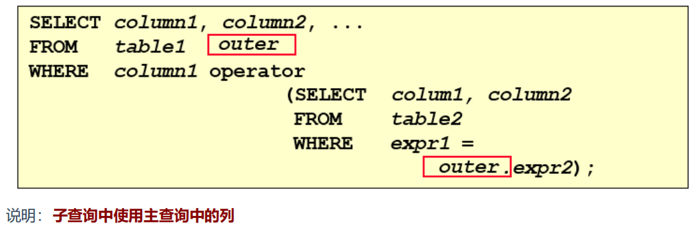
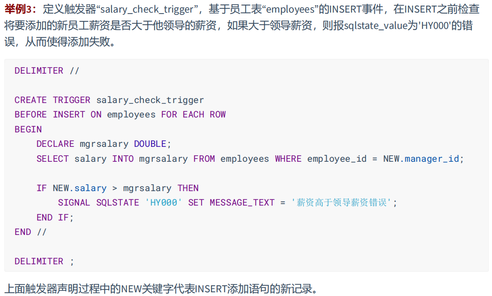

# MySQL
## 1.库的基本操作
### 1.1 创建库
```sql
-- 方式一：
create database 数据库名;

-- 方式二：
create database 数据库名 character set 字符集;

-- 方式三：
create database if not exists 数据库名;
    
-- 创建atguigudb数据库，该名称不能与已经存在的数据库重名。
create database atguigudb;
```
### 1.2 使用库
```sql
use 数据库名;
#使用atguigudb数据库
use atguigudb;
```
>说明：如果没有使用use语句，后面针对数据库的操作也没有加“数据名”的限定，那么会报“ERROR 1046
(3D000): No database selected”（没有选择数据库）
> 
>使用完use语句之后，如果接下来的SQL都是针对一个数据库操作的，那就不用重复use了，如果要针对另
一个数据库操作，那么要重新use。
### 1.3 删除库
```sql
drop databases [if exists] 库名;
```
### 1.4 查看某个库的所有表格
```sql
show tables from 数据库名;
```
### 1.5 修改数据库


## 2.表管理
### 2.1 创建表
#### 2.1.1 创建方式一
```sql
create table [if not exists] 表名称(
       字段名 数据类型,
       字段名 数据类型
);
```
> 说明：如果是最后一个字段，后面就用加逗号，因为逗号的作用是分割每个字段。
```sql
#创建学生表
CREATE TABLE student (
    `id` INT,
    `name` VARCHAR(20) -- 说名字最长不超过20个字符
);
```
```sql
CREATE TABLE dept(
    -- int类型，自增
    deptno INT(2) AUTO_INCREMENT,
    dname VARCHAR(14),
    loc VARCHAR(13),
    -- 主键
    PRIMARY KEY (deptno)
);
```
#### 2.1.2 创建方式二


### 2.2 查看一个表的数据
```sql
select * from 数据库表名称;

--查看学生表的数据
select * from student;
```
### 2.3 添加一条记录
```sql
insert into 表名称 values(值列表);

--添加两条记录到student表中
insert into student values(1,'张三');
insert into student values(2,'李四');
```
### 2.4 查看表的创建信息
```sql
show create table 表名称

--查看student表的详细创建信息
show create table student
```
```sql
CREATE TABLE `student` (
  `id` int DEFAULT NULL,
  `name` varchar(20) DEFAULT NULL
) ENGINE=InnoDB DEFAULT CHARSET=utf8mb3
```

### 2.5 删除表格
```sql
drop table [if exists] 表名称;

--删除学生表
drop table student;
```
drop table语句不能回滚。

### 2.6 修改表

#### 2.6.1 追加一个列


#### 2.6.2 修改一个列

#### 2.6.3 重命名一个列

#### 2.6.4 删除一个列


### 2.7 重命名表


### 2.8 清空表


## 3.基本的 SELECT 语句
### 3.1 SELECT ... FROM
```sql
SELECT 标识选择哪些列
FROM 标识从哪个表中选择
```
```sql
SELECT *
FROM departments;
```
> 一般情况下，除非需要使用表中所有的字段数据，最好不要使用通配符‘*’。使用通配符虽然可以节省输入查询语句的时间，但是获取不需要的列数据通常会降低查询和所使用的应用程序的效率。通配符的优势是，当不知道所需要的列的名称时，可以通过它获取它们。在生产环境下，不推荐你直接使用 SELECT * 进行查询。

### 3.2 选定特定的列
```sql
SELECT department_id, location_id
FROM departments;
```


### 3.3 列的别名


### 3.4 去除重复行
默认情况下，查询会返回全部行，包括重复行


### 3.5 空值参与运算


### 3.6 着重号
我们需要保证表中的字段、表名等没有和保留字、数据库系统或常用方法冲突。如果真的相同，请在
SQL语句中使用一对``（着重号）引起来。

## 4.显示表结构
使用DESCRIBE 或 DESC 命令，表示表结构。
```sql
DESCRIBE employees;
或
DESC employees;
```


## 5.算术运算符

### 5.1 比较运算符
比较运算符用来对表达式左边的操作数和右边的操作数进行比较，比较的结果为真则返回1，比较的结果
为假则返回0，其他情况则返回NULL。
比较运算符经常被用来作为SELECT查询语句的条件来使用，返回符合条件的结果记录。


## 6.逻辑运算符


## 7.排序与分页
### 1.排序
#### 1.1排序数据

#### 1.2单列排序
```sql
select last_name,job_id,department_id,hire_date
from employees
order by hire_date;
```

```sql
select last_name,job_id,department_id,hire_date
from employees
order by hire_date desc;
```

#### 1.3多列排序
```sql
SELECT last_name,department_id,salary
FROM employees
ORDER BY department_id,salary DESC;
```


### 2.分页
#### 2.1背景

#### 2.2 实现规则

```sql
-- 前10条记录
SELECT * FROM employees LIMIT 0,10;
-- 或者
SELECT * FROM employees LIMIT 10;
```

```sql
-- 第11至20条记录
SELECT * FROM employees LIMIT 10,10;
```


```sql
-- 第21至30条记录
SELECT * FROM employees LIMIT 20,10;
```


#### 2.3 扩展


## 8.多表查询
多表查询，也称为关联查询，指两个或更多个表一起完成查询操作。

前提条件：这些一起查询的表之间是有关系的（一对一、一对多），它们之间一定是有关联字段，这个关联字段可能建立了外键，也可能没有建立外键。比如：员工表和部门表，这两个表依靠“部门编号”进行关联。

### 1.一个案例引发的多表连接
#### 1.1 案例说明

从多个表中获取数据：

#### 1.2 笛卡尔积（交叉连接）的理解


```sql
-- 查询员工姓名和所在部门名称
SELECT last_name,department_name FROM employees,departments;
SELECT last_name,department_name FROM employees CROSS JOIN departments;
SELECT last_name,department_name FROM employees INNER JOIN departments;
SELECT last_name,department_name FROM employees JOIN departments;
```
#### 1.3 案例分析与问题解决

```sql
SELECT table1.column, table2.column
FROM table1, table2
WHERE table1.column1 = table2.column2; -- 连接条件
```


### 2.多表查询的分类讲解
#### 分类1：等值连接 vs 非等值连接
##### 等值连接

```sql
SELECT
	employees.employee_id,
	employees.last_name,
	employees.department_id,
	departments.department_id,
	departments.location_id 
FROM
	employees,departments 
WHERE employees.department_id = departments.department_id;
```


```sql
-- 练习：查询出公司员工的 last_name,department_name, city
SELECT e.last_name,d.department_name,l.city
FROM employees e,departments d,locations l
WHERE e.department_id = d.department_id AND d.location_id = l.location_id;
```


#### 非等值连接

```sql
SELECT e.last_name,e.salary,j.grade_level
FROM employees e,job_grades j
WHERE e.salary BETWEEN j.lowest_sal AND j.highest_sal;
```

#### 分类2：自连接 vs 非自连接

题目：查询employees表，返回“Xxx works for Xxx”
```sql
SELECT CONCAT(worker.last_name,' worker for ',manager.last_name)
FROM employees worker, employees manager
WHERE worker.manager_id = manager.employee_id;
```

```sql
-- 练习：查询出last_name为 ‘Chen’ 的员工的 manager 的信息。
SELECT e.employee_id,e.first_name,e.last_name,d.department_id,d.department_name,e.salary,l.city
FROM employees e,departments d,locations l
WHERE e.department_id = d.department_id AND d.location_id = l.location_id AND e.last_name LIKE 'Chen';
```


#### 分类3：内连接 vs 外连接
除了查询满足条件的记录以外，外连接还可以查询某一方不满足条件的记录。


### 3.SQL99语法实现多表查询
#### 3.1 基本语法
+ 使用 JOIN...ON子句创建连接的语法结构
```sql
SELECT table1.column, table2.column,table3.column
FROM table1
    JOIN table2 ON table1 和 table2 的连接条件
        JOIN table3 ON table2 和 table3 的连接条件
```
它的嵌套逻辑类似我们使用的 FOR 循环：
```java
for t1 in table1:
    for t2 in table2:
        if condition1:
            for t3 in table3:
                if condition2:
                    output t1 + t2 + t3
```
SQL99 采用的这种嵌套结构非常清爽、层次性更强、可读性更强，即使再多的表进行连接也都清晰可见。如果你采用 SQL92，可读性就会大打折扣。


#### 3.2 内连接(INNER JOIN)的实现

```sql
SELECT e.employee_id, e.last_name, e.department_id, d.department_id, d.location_id
FROM employees e JOIN departments d
ON (e.department_id = d.department_id);
```

```sql
SELECT employee_id, city, department_name
FROM employees e
JOIN departments d
ON d.department_id = e.department_id
JOIN locations l
ON d.location_id = l.location_id;
```


#### 3.3 外连接(OUTER JOIN)的实现
##### 3.3.1 左外连接(LEFT OUTER JOIN)

```sql
SELECT e.last_name, e.department_id, d.department_name
FROM employees e
LEFT OUTER JOIN departments d
ON (e.department_id = d.department_id);
```


##### 3.3.2 右外连接(RIGHT OUTER JOIN)

```sql
-- 右外连接
SELECT e.last_name, e.department_id, d.department_name
FROM employees e
RIGHT OUTER JOIN departments d
ON (e.department_id = d.department_id);
```


### 4. UNION的使用


### 5. 7种SQL JOINS的实现

#### 5.7.1 代码实现
```sql
-- 中图：内连接 A∩B
SELECT employee_id,last_name,department_name
FROM employees e JOIN departments d
ON e.`department_id` = d.`department_id`;
```
```sql
-- 左上图：左外连接
SELECT employee_id,last_name,department_name
FROM employees e LEFT JOIN departments d
ON e.`department_id` = d.`department_id`;
```
```sql
-- 右上图：右外连接
SELECT employee_id,last_name,department_name
FROM employees e RIGHT JOIN departments d
ON e.`department_id` = d.`department_id`;
```
```sql
-- 左中图：A - A∩B
SELECT employee_id,last_name,department_name
FROM employees e LEFT JOIN departments d
ON e.`department_id` = d.`department_id`
WHERE d.`department_id` IS NULL
```
```sql
-- 右中图：B-A∩B
SELECT employee_id,last_name,department_name
FROM employees e RIGHT JOIN departments d
ON e.`department_id` = d.`department_id`
WHERE e.`department_id` IS NULL
```
```sql
-- 左下图：满外连接
-- 左中图 + 右上图 A∪B
SELECT employee_id,last_name,department_name
FROM employees e LEFT JOIN departments d
ON e.`department_id` = d.`department_id`
WHERE d.`department_id` IS NULL
UNION ALL -- 没有去重操作，效率高
SELECT employee_id,last_name,department_name
FROM employees e RIGHT JOIN departments d
ON e.`department_id` = d.`department_id`;
```
```sql
-- 右下图
-- 左中图 + 右中图 A ∪B- A∩B 或者 (A - A∩B) ∪ （B - A∩B）
SELECT employee_id,last_name,department_name
FROM employees e LEFT JOIN departments d
ON e.`department_id` = d.`department_id`
WHERE d.`department_id` IS NULL
UNION ALL
SELECT employee_id,last_name,department_name
FROM employees e RIGHT JOIN departments d
ON e.`department_id` = d.`department_id`
WHERE e.`department_id` IS NULL
```
#### 5.7.2 语法格式小结
+ 左中图
```sql
-- 实现A - A∩B
select 字段列表
from A表 left join B表
on 关联条件
where 从表关联字段 is null and 等其他子句;
```
+ 右中图
```sql
-- 实现B - A∩B
select 字段列表
from A表 right join B表
on 关联条件
where 从表关联字段 is null and 等其他子句;
```
+ 左下图
```sql
-- 实现查询结果是A∪B
-- 用左外的A，union 右外的B
select 字段列表
from A表 left join B表
on 关联条件
where 等其他子句
union
select 字段列表
from A表 right join B表
on 关联条件
where 等其他子句;
```
+ 右下图
```sql
-- 实现A∪B - A∩B 或 (A - A∩B) ∪ （B - A∩B）
-- 使用左外的 (A - A∩B) union 右外的（B - A∩B）
select 字段列表
from A表 left join B表
on 关联条件
where 从表关联字段 is null and 等其他子句
union
select 字段列表
from A表 right join B表
on 关联条件
where 从表关联字段 is null and 等其他子句
```

### 6.SQL99语法新特性
#### 6.1 自然连接

#### 6.2 USING连接


## 9.函数
### 1.数值函数
#### 1.1 基本函数

```sql
SELECT
ABS(-123),ABS(32),SIGN(-23),SIGN(43),PI(),CEIL(32.32),CEILING(-43.23),FLOOR(32.32),
FLOOR(-43.23),MOD(12,5)
FROM DUAL;
```

```sql
SELECT RAND(),RAND(),RAND(10),RAND(10),RAND(-1),RAND(-1)
FROM DUAL;
```

```sql
SELECT
ROUND(12.33),ROUND(12.343,2),ROUND(12.324,-1),TRUNCATE(12.66,1),TRUNCATE(12.66,-1)
FROM DUAL;
```


#### 1.2 角度与弧度互换函数

```sql
SELECT RADIANS(30),RADIANS(60),RADIANS(90),DEGREES(2*PI()),DEGREES(RADIANS(90))
FROM DUAL;
```


#### 1.3 三角函数


#### 1.4 指数和对数


#### 1.5 进制转换


### 2 字符串函数


### 3.日期和时间函数
#### 3.1 获取日期、时间


#### 3.2 日期与时间戳的转换


#### 3.3 获取月份、星期、星期数、天数等函数

```sql
SELECT YEAR(CURDATE()),MONTH(CURDATE()),DAY(CURDATE()),
HOUR(CURTIME()),MINUTE(NOW()),SECOND(SYSDATE())
FROM DUAL;
```


#### 3.4 日期的格式化与解析


#### 4.流程控制函数


```sql
SELECT IF(1 > 0,'正确','错误')
->正确
```

```sql
SELECT IFNULL(null,'Hello Word')
->Hello Word
```

```sql
SELECT CASE
    WHEN 1 > 0
    THEN '1 > 0'
    WHEN 2 > 0
    THEN '2 > 0'
    ELSE '3 > 0'
    END
->1 > 0
```

```sql
SELECT CASE 1
    WHEN 1 THEN '我是1'
    WHEN 2 THEN '我是2'
ELSE '你是谁'
```

```sql
SELECT employee_id,salary, CASE WHEN salary>=15000 THEN '高薪'
                    WHEN salary>=10000 THEN '潜力股'
                    WHEN salary>=8000 THEN '屌丝'
                    ELSE '草根' END "描述"
FROM employees;
```


```sql
SELECT oid,`status`, CASE `status` WHEN 1 THEN '未付款'
                                   WHEN 2 THEN '已付款'
                                   WHEN 3 THEN '已发货'
                                   WHEN 4 THEN '确认收货'
                                   ELSE '无效订单' END
FROM t_order;
```
```sql
SELECT employee_id,12 * salary * (1 + IFNULL(commission_pct,0))
FROM employees;
```

```sql
SELECT last_name, job_id, salary,
        CASE job_id WHEN 'IT_PROG' THEN 1.10*salary
                    WHEN 'ST_CLERK' THEN 1.15*salary
                    WHEN 'SA_REP' THEN 1.20*salary
                    ELSE salary END "REVISED_SALARY"
FROM employees;
```


### 2.聚合函数
#### 2.1 聚合函数介绍


聚合函数不能嵌套调用。比如不能出现类似“AVG(SUM(字段名称))”形式的调用。
##### 2.1.1 AVG和SUM函数
可以对**数值型数据**使用AVG 和 SUM 函数。
```sql
SELECT AVG(salary), MAX(salary), MIN(salary), SUM(salary)
FROM employees
WHERE job_id LIKE '%REP%';
```


##### 2.1.2 MIN和MAX函数


##### 2.1.3 COUNT函数


#### 2.2 GROUP BY
##### 2.2.1 基本使用

```sql
SELECT department_id, AVG(salary)
FROM employees
GROUP BY department_id ;
```

##### 2.2.2 使用多个列分组

```sql
SELECT department_id dept_id, job_id, SUM(salary)
FROM employees
GROUP BY department_id, job_id;
```


##### 2.2.3 GROUP BY中使用WITH ROLLUP


#### 2.3 HAVING
##### 2.3.1 基本使用


```sql
SELECT department_id, MAX(salary)
FROM employees
GROUP BY department_id
HAVING MAX(salary)>10000 ;
```


##### 2.3.2 WHERE和HAVING的对比


## 10.SELECT的执行过程
### 10.1 查询的结构
```sql
-- 方式1：
SELECT ...,....,...
FROM ...,...,....
WHERE 多表的连接条件
AND 不包含组函数的过滤条件
GROUP BY ...,...
HAVING 包含组函数的过滤条件
ORDER BY ... ASC/DESC
LIMIT ...,...;


-- 方式2：
SELECT ...,....,...
FROM ... JOIN ...
ON 多表的连接条件
JOIN ...
ON ...
WHERE 不包含组函数的过滤条件
AND/OR 不包含组函数的过滤条件
GROUP BY ...,...
HAVING 包含组函数的过滤条件
ORDER BY ... ASC/DESC
LIMIT ...,...

-- 其中：
-- （1）from：从哪些表中筛选
-- （2）on：关联多表查询时，去除笛卡尔积
-- （3）where：从表中筛选的条件
-- （4）group by：分组依据
-- （5）having：在统计结果中再次筛选
-- （6）order by：排序
-- （7）limit：分页
```

### 10.2 SELECT执行顺序


## 11.子查询
### 11.1 需求分析与问题解决
#### 11.1.1 实际问题

现有的解决方式：
```sql
-- 方式一：
SELECT salary
FROM employees
WHERE last_name = 'Abel';

SELECT last_name,salary
FROM employees
WHERE salary > 11000;

-- 方式二：自连接
SELECT e2.last_name,e2.salary
FROM employees e1,employees e2
WHERE e1.last_name = 'Abel'
AND e1.`salary` < e2.`salary`

-- 方式三：子查询
SELECT last_name,salary
FROM employees
WHERE salary > (
    SELECT salary
    FROM employees
    WHERE last_name = 'Abel'
);
```

#### 11.1.2 子查询的基本使用

#### 11.1.3 子查询的分类


### 11.2 单行子查询
#### 11.2.1 单行比较操作符


#### 11.2.2 代码示例
题目：查询工资大于149号员工工资的员工的信息
```sql
SELECT last_name
FROM employees
WHERE salary > (SELECT salary
				FROM employees
				WHERE employee_id = 149);
```

题目：返回job_id与141号员工相同，salary比143号员工多的员工姓名，job_id和工资
```sql
SELECT last_name, job_id, salary
FROM employees
WHERE job_id = (SELECT job_id
				FROM employees
				WHERE employee_id = 141)
AND   salary > (SELECT salary
				FROM employees
				WHERE employee_id = 143);
```

题目：返回公司工资最少的员工的last_name,job_id和salary
```sql
SELECT last_name,job_id,salary
FROM employees
WHERE salary = (SELECT MIN(salary)
				FROM employees);
```

题目：查询与141号或174号员工的manager_id和department_id相同的其他员工的employee_id，manager_id，department_id
实现方式1：不成对比较
```sql
SELECT employee_id,manager_id,department_id 
FROM employees 
WHERE manager_id IN (SELECT manager_id 
					 FROM employees 
					 WHERE employee_id IN ( 174, 141 )) 
AND department_id IN (SELECT department_id 
					  FROM employees 
					  WHERE employee_id IN ( 174, 141 )) 
AND employee_id NOT IN ( 174, 141 );
```
实现方式2：成对比较
```sql
SELECT employee_id,manager_id,department_id
FROM employees
WHERE (manager_id, department_id) IN
					(SELECT manager_id,department_id
					 FROM employees
					 WHERE employee_id IN (141,174))
AND employee_id NOT IN (141,174);
```
#### 11.2.3 HAVING中的子查询


#### 11.2.4 CASE中的子查询
题目：显式员工的employee_id,last_name和location。其中，若员工department_id与location_id为1800的department_id相同，则location为’Canada’，其余则为’USA’。
```sql
SELECT employee_id,last_name,
	 (CASE department_id
	 WHEN (SELECT department_id
		   FROM departments
		   WHERE location_id = 1800) 		
		   THEN 'Canada' ELSE 'USA' END) location
FROM employees;
```


#### 11.2.5 子查询的空值问题


#### 11.2.6 非法使用子查询


### 11.3 多行子查询
#### 11.3.1 多行比较操作符


题目：返回其它job_id中比job_id为‘IT_PROG’部门所有工资都低的员工的员工号、姓名、job_id以及salary

题目：查询平均工资最低的部门id
```sql
-- 方式一：
SELECT department_id
FROM employees
GROUP BY department_id
HAVING AVG(salary) = (SELECT MIN(avg_sal)
			FROM (
				SELECT AVG(salary) avg_sal
				FROM employees
				GROUP BY department_id
				) dept_avg_sal
			)

-- 方式二：
SELECT department_id
FROM employees
GROUP BY department_id
HAVING AVG(salary) <= ALL(
			SELECT AVG(salary) avg_sal
			FROM employees
			GROUP BY department_id
			)
```

#### 11.3.2 空值问题


### 11.4 相关子查询
#### 11.4.1 相关子查询执行流程


题目：查询员工中工资大于本部门平均工资的员工的last_name,salary和其department_id
```sql
-- 方式一：相关子查询
SELECT last_name,salary,department_id
FROM employees e
WHERE salary > 
			(SELECT AVG(salary)
			 FROM employees
			 WHERE department_id = e.department_id);
```
```sql
-- 方式二：在from中使用子查询
SELECT last_name,salary,e1.department_id
FROM employees e1,(SELECT department_id,AVG(salary) dept_avg_sal
									 FROM employees
									 GROUP BY department_id) e2
WHERE e1.department_id = e2.department_id
AND e2.dept_avg_sal < e1.salary;
```

在ORDER BY 中使用子查询：
题目：查询员工的id,salary,按照department_name 排序
```sql
-- 题目：查询员工的id,salary,按照department_name 排序
SELECT employee_id,salary
FROM employees e
ORDER BY (
		SELECT department_name
		FROM departments d
		WHERE e.department_id = d.department_id
);
```
题目：若employees表中employee_id与job_history表中employee_id相同的数目不小于2，输出这些相同id的员工的employee_id,last_name和其job_id
```sql
SELECT e.employee_id,last_name,e.job_id
FROM employees e
WHERE 2 <= (SELECT COUNT(*)
            FROM job_history
						WHERE employee_id = e.employee_id);
```
#### 11.4.2 EXISTS 与 NOT EXISTS关键字

题目：查询公司管理者的employee_id，last_name，job_id，department_id信息
```sql
-- 方式一：
SELECT employee_id,last_name,job_id,department_id
FROM employees e1
WHERE EXISTS (SELECT *
						  FROM employees e2
							WHERE e2.manager_id = e1.employee_id);
```
```sql
-- 方式二：自连接
SELECT DISTINCT e1.employee_id,e1.last_name,e1.job_id,e1.department_id
FROM employees e1 JOIN employees e2
WHERE e1.employee_id = e2.manager_id;
```
```sql
-- 方式三：
SELECT employee_id,last_name,job_id,department_id
FROM employees
WHERE employee_id IN (
    SELECT DISTINCT manager_id
    FROM employees);
```
题目：查询departments表中，不存在于employees表中的部门的department_id和department_name


#### 11.4.3 相关更新
```sql
UPDATE table1 alias1
SET column = (SELECT expression
                FROM table2 alias2
                WHERE alias1.column = alias2.column);
```
使用相关子查询依据一个表中的数据更新另一个表的数据。


#### 11.4.4 相关删除


## 12.数据处理之增删改
### 12.1 插入数据

方式1：VALUES的方式添加


方式2：将查询结果插入到表中

```sql
INSERT INTO emp2
SELECT *
FROM employees
WHERE department_id = 90;
```
```sql
INSERT INTO sales_reps(id, name, salary, commission_pct)
SELECT employee_id, last_name, salary, commission_pct
FROM employees
WHERE job_id LIKE '%REP%';
```
### 12.2 更新数据

使用 UPDATE 语句更新数据。语法如下：


### 12.3 删除数据


### 12.4 综合案例


```sql
-- 1、创建数据库test01_library
CREATE DATABASE IF NOT EXISTS test01_library CHARACTER SET 'utf8';

-- 使用该库
USE test01_library;

-- 2、创建表 books
CREATE TABLE books(
		`id` INT,
		`name` VARCHAR(50),
		`authors` VARCHAR(100),
		price FLOAT,
		pubdate YEAR,
		note VARCHAR(100),
		num INT
);


-- 3、向books表中插入记录
-- 1）不指定字段名称，插入第一条记录
INSERT INTO books
VALUES(1,'Tal of AAA','Dickes',23,1995,'novel',11);

-- 2）指定所有字段名称，插入第二记录
INSERT INTO books (id, `name`, `authors`, price, pubdate, note, num)
VALUES(2,'EmmaT','Jane lura',35,1993,'Joke',22);

-- 3）同时插入多条记录（剩下的所有记录）
INSERT INTO books(id, `name`, `authors`, price, pubdate, note, num) VALUES
(3,'Story of Jane','Jane Tim',40,2001,'novel',0),
(4,'Lovey Day','George Byron',20,2005,'novel',30),
(5,'Old land','Honore Blade',30,2010,'Law',0),
(6,'The Battle','Upton Sara',30,1999,'medicine',40),
(7,'Rose Hood','Richard haggard',28,2008,'cartoon',28);

-- 4、将小说类型(novel)的书的价格都增加5。
UPDATE books SET price=price+5 WHERE note = 'novel';

-- 5、将名称为EmmaT的书的价格改为40，并将说明改为drama。
UPDATE books SET price=40,note='drama' WHERE `name`='EmmaT';

-- 6、删除库存为0的记录。
DELETE FROM books WHERE num=0;

-- 7、统计书名中包含a字母的书
SELECT * FROM books WHERE `name` LIKE '%a%';

-- 8、统计书名中包含a字母的书的数量和库存总量
SELECT COUNT(*),SUM(num) FROM books WHERE `name` LIKE '%a%';

-- 9、找出“novel”类型的书，按照价格降序排列
SELECT * FROM books WHERE note = 'novel' ORDER BY price DESC;

-- 10、查询图书信息，按照库存量降序排列，如果库存量相同的按照note升序排列
SELECT * FROM books ORDER BY num DESC,note ASC;

-- 11、按照note分类统计书的数量
SELECT note,COUNT(*) FROM books GROUP BY note;

-- 12、按照note分类统计书的库存量，显示库存量超过30本的
SELECT note,SUM(num) FROM books GROUP BY note HAVING SUM(num) > 30;

-- 13、查询所有图书，每页显示5本，显示第二页
SELECT * FROM books LIMIT 5,5;

-- 14、按照note分类统计书的库存量，显示库存量最多的
SELECT note,SUM(num) sum_num FROM books GROUP BY note ORDER BY sum_num DESC LIMIT 0,1;

-- 15、查询书名达到10个字符的书，不包括里面的空格
SELECT * FROM books WHERE CHAR_LENGTH(REPLACE(`name`,' ',''))>=10;

/*
16、查询书名和类型，
其中note值为 novel显示小说，law显示法律，medicine显示医药，cartoon显示卡通，joke显示笑话
*/
SELECT name AS "书名" ,note, CASE note
WHEN 'novel' THEN '小说'
WHEN 'law' THEN '法律'
WHEN 'medicine' THEN '医药'
WHEN 'cartoon' THEN '卡通'
WHEN 'joke' THEN '笑话'
END AS "类型"
FROM books;

-- 17、查询书名、库存，其中num值超过30本的，显示滞销，大于0并低于10的，显示畅销，为0的显示需要无货
SELECT name,num,CASE
	WHEN num>30 THEN '滞销'
	WHEN num>0 AND num<10 THEN '畅销'
	WHEN num=0 THEN '无货'
	ELSE '正常'
	END AS "库存状态"
FROM books;

-- 18、统计每一种note的库存量，并合计总量
SELECT IFNULL(note,'合计总库存量') AS note,SUM(num)
FROM books
GROUP BY note WITH ROLLUP;

-- 19、统计每一种note的数量，并合计总量
SELECT IFNULL(note,'合计总数') AS note,COUNT(*)
FROM books
GROUP BY note WITH ROLLUP;

-- 20、统计库存量前三名的图书
SELECT * FROM books
ORDER BY num DESC LIMIT 0,3;

-- 21、找出最早出版的一本书
SELECT * FROM books
ORDER BY pubdate ASC LIMIT 0,1;

-- 22、找出novel中价格最高的一本书
SELECT * 
FROM books
WHERE note = 'novel'
ORDER BY price DESC LIMIT 0,1;

-- 23、找出书名中字数最多的一本书，不含空格
SELECT *
FROM books
ORDER BY CHAR_LENGTH(REPLACE(`name`,' ','')) DESC LIMIT 0,1;
```
## 13.约束
### 13.1 非空约束


删除非空约束


### 13.2 唯一性约束
关键字： UNIQUE

特点

#### 13.2.1 添加唯一约束


#### 13.2.2 关于复合唯一约束
```sql
create table 表名称(
    字段名 数据类型,
    字段名 数据类型,
    字段名 数据类型,
    unique key(字段列表) #字段列表中写的是多个字段名，多个字段名用逗号分隔，表示那么是复合唯一，即多
    个字段的组合是唯一的
);
```
```sql
#学生表
create table student(
    sid int, #学号
    sname varchar(20), #姓名
    tel char(11) unique key, #电话
    cardid char(18) unique key #身份证号
);
#课程表
create table course(
    cid int, #课程编号
    cname varchar(20) #课程名称
);
#选课表
create table student_course(
    id int,
    sid int,
    cid int,
    score int,
    unique key(sid,cid) #复合唯一
);
```
```sql
insert into student values(1,'张三','13710011002','101223199012015623');#成功
insert into student values(2,'李四','13710011003','101223199012015624');#成功
insert into course values(1001,'Java'),(1002,'MySQL');#成功
```
### 13.3 PRIMARY KEY 约束
#### 13.3.1 添加主键约束
##### 13.3.1.1 建表时指定主键约束
```sql
create table 表名称(
    字段名 数据类型 primary key, #列级模式
    字段名 数据类型,
    字段名 数据类型
);
create table 表名称(
    字段名 数据类型,
    字段名 数据类型,
    字段名 数据类型,
    [constraint 约束名] primary key(字段名) #表级模式
);
```


##### 13.3.1.2 建表后增加主键约束
```sql
ALTER TABLE 表名称 ADD PRIMARY KEY(字段列表); -- 字段列表可以是一个字段，也可以是多个字段，如果是多个字段的话，是复合主键
```

#### 13.3.2 复合主键
```sql
create table 表名称(
    字段名 数据类型,
    字段名 数据类型,
    字段名 数据类型,
    primary key(字段名1,字段名2) -- 表示字段1和字段2的组合是唯一的，也可以有更多个字段
);
```
```sql
-- 学生表
create table student(
    sid int primary key, -- 学号
    sname varchar(20) -- 学生姓名
);
-- 课程表
create table course(
    cid int primary key, -- 课程编号
    cname varchar(20) -- 课程名称
);
-- 选课表
create table student_course(
    sid int,
    cid int,
    score int,
    primary key(sid,cid) -- 复合主键
);
```
#### 13.3.3 删除主键约束


### 13.4 自增列：AUTO_INCREMENT
#### 13.4.1 作用
某个字段的值自增
#### 13.4.2 关键字
auto_increment
#### 13.4.3 特点和要求

#### 13.4.4 如何指定自增约束

```sql
create table employee(
    eid int primary key auto_increment,
    ename varchar(20)
);
```

#### 13.4.5 如何删除自增约束


### 13.5 FOREIGN KEY 约束


### 13.6 CHECK约束
#### 13.6.1 作用
检查某个字段的值是否符号xx要求，一般指的是值的范围
#### 13.6.2 关键字
CHECK

```sql
create table employee(
    eid int primary key,
    ename varchar(5),
    gender char check ('男' or '女')
);
```
```sql
insert into employee values(1,'张三','妖');
```
```sql
CREATE TABLE temp(
    id INT AUTO_INCREMENT,
    NAME VARCHAR(20),
    age INT CHECK(age > 20),
    PRIMARY KEY(id)
);
```
```sql
age tinyint check(age >20) 或 sex char(2) check(sex in('男','女'))
```

### 13.7 DEFAULT约束
#### 13.7.1 作用
给某个字段/某列指定默认值，一旦设置默认值，在插入数据时，如果此字段没有显式赋值，则赋值为默认值。
#### 13.7.2 关键字
DEFAULE
#### 13.7.3 如何给字段加默认值
```sql
create table 表名称(
    字段名 数据类型 primary key,
    字段名 数据类型 unique key not null,
    字段名 数据类型 unique key,
    字段名 数据类型 not null default 默认值,
);

create table 表名称(
     字段名 数据类型 default 默认值 ,
     字段名 数据类型 not null default 默认值,
     字段名 数据类型 not null default 默认值,
     primary key(字段名),
     unique key(字段名)
);
```


## 14.视图
### 14.1 视图的理解


### 14.2 创建视图

#### 14.2.1 创建单表视图


#### 14.2.2 创建多表联合视图
```sql
CREATE VIEW empview
AS
SELECT employee_id emp_id,last_name NAME,department_name
FROM employees e,departments d
WHERE e.department_id = d.department_id;
```
#### 14.2.3 基于视图创建视图


### 14.3 查看视图


## 15.触发器

### 15.1 触发器概述

### 15.2 触发器创建

```sql
-- 创建数据表
CREATE TABLE test_trigger (
id INT PRIMARY KEY AUTO_INCREMENT,
t_note VARCHAR(30)
);
CREATE TABLE test_trigger_log (
id INT PRIMARY KEY AUTO_INCREMENT,
t_log VARCHAR(30)
);
```
创建触发器：创建名称为before_insert的触发器，向test_trigger数据表插入数据之前，向test_trigger_log数据表中插入before_insert的日志信息。
```sql
DELIMITER //
CREATE TRIGGER before_insert
BEFORE INSERT ON test_trigger
FOR EACH ROW
BEGIN
    INSERT INTO test_trigger_log (t_log)
    VALUES('before_insert');
END //
DELIMITER ;   
```
向test_trigger数据表中插入数据
```sql
INSERT INTO test_trigger (t_note) VALUES ('测试 BEFORE INSERT 触发器');
```


### 15.3 查看、删除触发器
#### 15.3.1 查看触发器

#### 15.3.2 删除触发器


