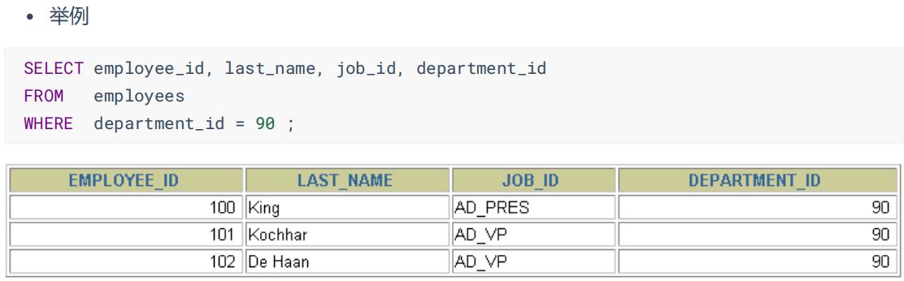

# MySQL
##
### 创建库
```sql
create database 数据库名;

#创建atguigudb数据库，该名称不能与已经存在的数据库重名。
create database atguigudb;
```
### 使用库
```sql
use 数据库名;
#使用atguigudb数据库
use atguigudb;
```
>说明：如果没有使用use语句，后面针对数据库的操作也没有加“数据名”的限定，那么会报“ERROR 1046
(3D000): No database selected”（没有选择数据库）
> 
>使用完use语句之后，如果接下来的SQL都是针对一个数据库操作的，那就不用重复use了，如果要针对另
一个数据库操作，那么要重新use。
### 删除库
```sql
drop databases [if exists] 库名;
```
### 查看某个库的所有表格
```sql
show tables from 数据库名;
```

## 表管理
### 创建表
```sql
create table 表名称(
       字段名 数据类型,
       字段名 数据类型
);
```
> 说明：如果是最后一个字段，后面就用加逗号，因为逗号的作用是分割每个字段。
```sql
#创建学生表
CREATE TABLE student (
    `id` INT,
    `name` VARCHAR(20) -- 说名字最长不超过20个字符
);
```
### 查看一个表的数据
```sql
select * from 数据库表名称;

--查看学生表的数据
select * from student;
```
### 添加一条记录
```sql
insert into 表名称 values(值列表);

--添加两条记录到student表中
insert into student values(1,'张三');
insert into student values(2,'李四');
```
### 查看表的创建信息
```sql
show create table 表名称

--查看student表的详细创建信息
show create table student
```
```sql
CREATE TABLE `student` (
  `id` int DEFAULT NULL,
  `name` varchar(20) DEFAULT NULL
) ENGINE=InnoDB DEFAULT CHARSET=utf8mb3
```

### 删除表格
```sql
drop table 表名称;

--删除学生表
drop table student;
```
## 基本的 SELECT 语句
### SELECT ... FROM
```sql
SELECT 标识选择哪些列
FROM 标识从哪个表中选择
```
```sql
SELECT *
FROM departments;
```
> 一般情况下，除非需要使用表中所有的字段数据，最好不要使用通配符‘*’。使用通配符虽然可以节省输入查询语句的时间，但是获取不需要的列数据通常会降低查询和所使用的应用程序的效率。通配符的优势是，当不知道所需要的列的名称时，可以通过它获取它们。在生产环境下，不推荐你直接使用 SELECT * 进行查询。

#### 选定特定的列
```sql
SELECT department_id, location_id
FROM departments;
```


### 列的别名


### 去除重复行
默认情况下，查询会返回全部行，包括重复行


### 空值参与运算


### 着重号
我们需要保证表中的字段、表名等没有和保留字、数据库系统或常用方法冲突。如果真的相同，请在
SQL语句中使用一对``（着重号）引起来。

## 显示表结构
使用DESCRIBE 或 DESC 命令，表示表结构。
```sql
DESCRIBE employees;
或
DESC employees;
```




## 算术运算符

### 比较运算符
比较运算符用来对表达式左边的操作数和右边的操作数进行比较，比较的结果为真则返回1，比较的结果
为假则返回0，其他情况则返回NULL。
比较运算符经常被用来作为SELECT查询语句的条件来使用，返回符合条件的结果记录。


## 逻辑运算符


