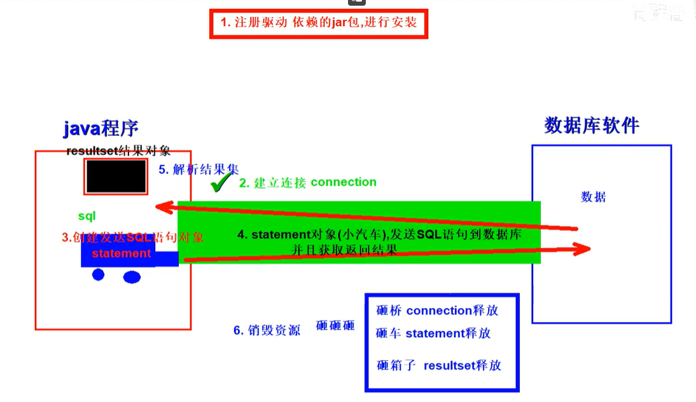
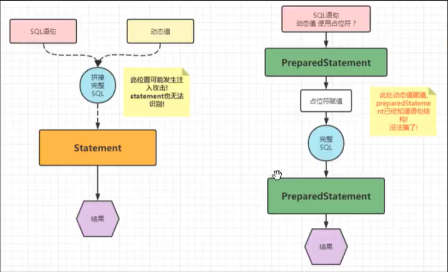
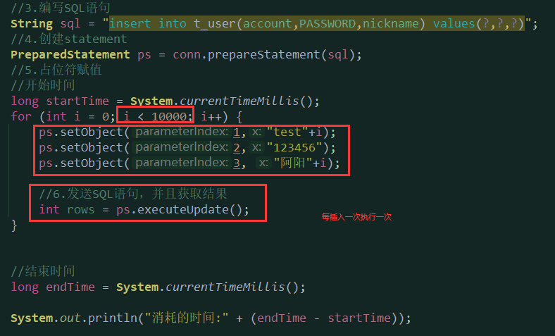
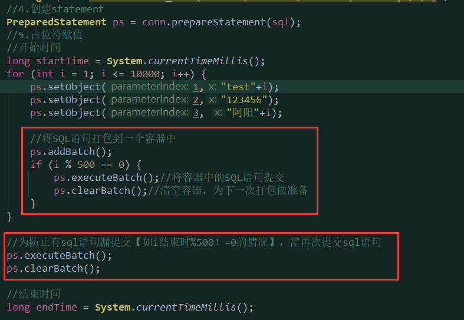
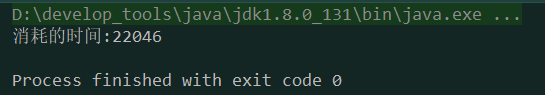
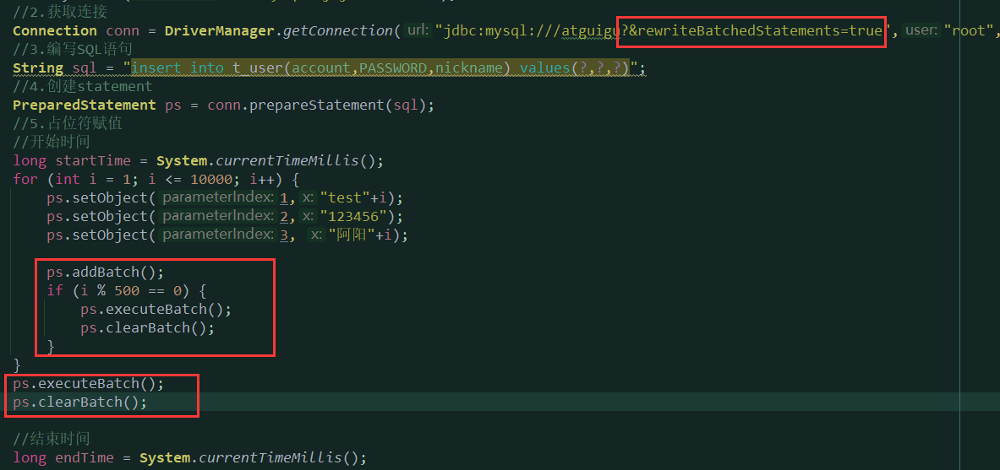
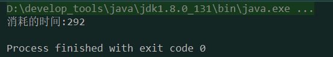
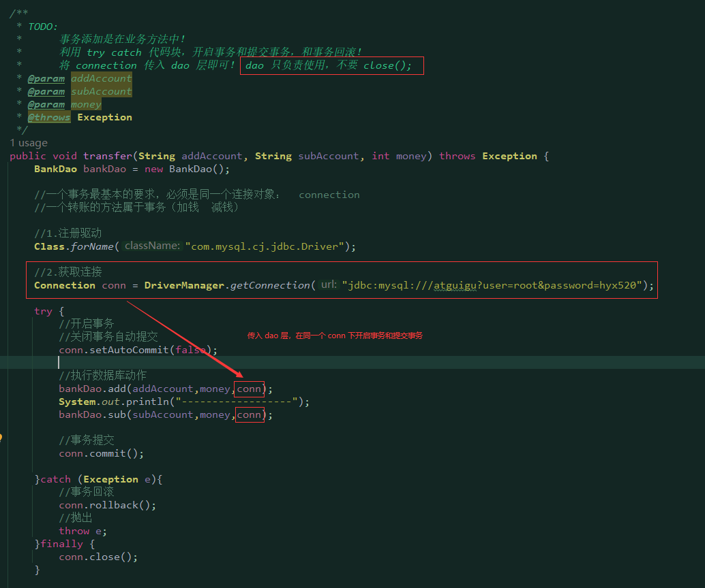
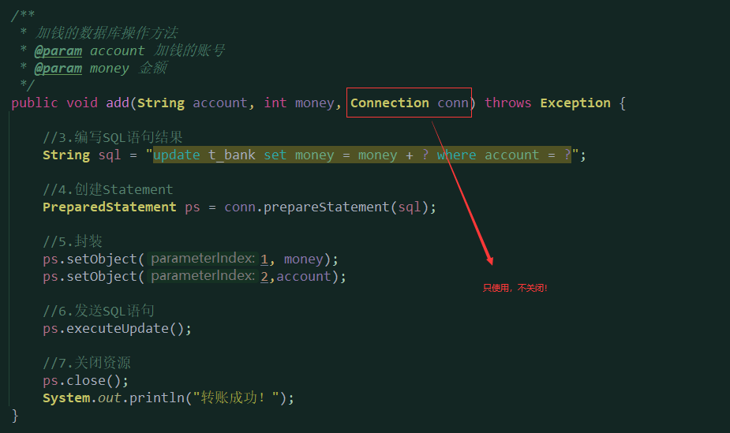

## 2023/09/01 学习了jdbc的使用步骤，视频内容不多但是最近事比较多，所以只看了一点点，进度有点落后了！
# JDBC 使用的步骤

## 1.使用Statement
```java
public class StatementQueryPart {
    /**
     *
     * TODO：
     *      DriverManager
     *      Connection
     *      Statement
     *      ResultSet
     *
     * @param args
     */
    public static void main(String[] args) throws SQLException {
        //1.注册驱动
        /**
         * TODO:
         *      注册驱动
         *      依赖：驱动版本 8+ com.mysql.cj.jdbc.Driver
         *           驱动版本 5+ com.mysql.jdbc.Driver
         *
         */
        DriverManager.registerDriver(new Driver());
        //2.获取连接
        /**
         * TODO:
         *      java程序要和数据库创建连接！
         *      JAVA程序，连接数据库，肯定是调用某个方法，方法也需要填入连接数据库的基本信息：
         *              数据库 ip 地址 127.0.0.1
         *              数据库端口号 3306
         *              账号：root
         *              密码：root
         *              连接数据库的名称：atguigu
         */

        /**
         * 参数1 ： url
         *         jdbc:数据库厂商名://ip地址:port/数据库名
         *         jdbc:mysql://127.0.0.1:3306/atguigu
         * 参数2 ： username 数据库软件的账号
         * 参数3 ： password 数据库软件的密码
         */
        // java.sql 接口 = 实现类
        Connection connection = DriverManager.getConnection("jdbc:mysql://127.0.0.1:3306/atguigu", "root", "123456");
        //3.创建statement
        Statement statement = connection.createStatement();
        //4.发送SQL语句，并获取返回结果
        String sql = "select * from t_user";
        ResultSet resultSet = statement.executeQuery(sql);
        //5.进行结果集分析
        //先看看有没有下一行数据，有，你就可以获取
        while (resultSet.next()) {
            int id = resultSet.getInt("id");
            String account = resultSet.getString("account");
            String password = resultSet.getString("PASSWORD");
            String nickname = resultSet.getString("nickname");
            System.out.println(id + "---" + account + "---" + nickname);
        }
        //6.关闭资源
        resultSet.close();
        statement.close();
        connection.close();

    }
}
```

## 2.使用PreparedStatement

```java
package com.JackTang.api.preparedstatement;

import java.sql.*;
import java.util.Scanner;

/**
 * @author Jack Tang
 * @description 使用预编译的statement完成用户信息
 * @create 2023-09-01 0:52
 *
 * TODO： 防止注入攻击 | 演示 ps 的使用流程
 *
 */
public class PSUserLoginPart {
    public static void main(String[] args) throws ClassNotFoundException, SQLException {
        //1.键盘输入事件，收集账号和密码信息
        Scanner scan = new Scanner(System.in);
        System.out.println("请输入账号：");
        String account = scan.nextLine();
        System.out.println("请输入密码：");
        String password = scan.nextLine();

        //2.ps数据库的流程
        //1.ps数据库的注册
        Class.forName("com.mysql.cj.jdbc.Driver");

        //2.获取连接
        Connection connection = DriverManager.getConnection("jdbc:mysql:///atguigu", account, password);

        /**
         * statement
         *      1.创建statement
         *      2.拼接SQL语句
         *      3.发送SQL语句，并且获取返回结果
         *
         * preparedstatement
         *      1.编写SQL语句结构   不包含动态值部分的语句，动态值部分使用占位符 ? 替代  注意： ？ 只能替代动态值
         *      2.创建preparedstatement，并且传入动态值
         *      3.动态值  占位符  赋值  ? 单独赋值即可
         *      4.发送SQL语句即可，并获取返回结果
         */
        //3.编写SQL语句机构
        String sql = "select * from t_user where account = ? and `PASSWORD` = ? ;";

        //4.创建 ps
        PreparedStatement ps = connection.prepareStatement(sql);

        //5.占位符单独赋值
        /**
         * 参数1 ： int   占位符的下标从左到右，从1开始！
         * 参数2： object 占位符的值 可以设置任何数值
         */
        ps.setObject(2,password);
        ps.setObject(1,account);

        //其内部完成了字符串的拼接！
        //6.直接执行SQL语句即可，发送SQL语句并获取返回结果
        ResultSet resultSet = ps.executeQuery();

        //7.进行结果集对象解析
        if (resultSet.next()){
            //只要向下移动，就是有数据 就是登录成功！
            System.out.println("登录成功！");
        }else{
            System.out.println("登录失败！");
        }

        //8.关闭资源
        resultSet.close();
        ps.close();
        connection.close();

    }
}
```
## 2023/09/03 昨天没学！昨天没学！昨天没学！搬宿舍+出去打麻将直接荒废了一天，后悔莫及。今天必须把jdbc这个给拿下，继续保持进度！
### preparedstatement的增删改查
#### 增加数据
```java
 /**
     * 插入一条用户数据!
     * 账号: test
     * 密码: test
     * 昵称: 测试
*/
@Test
public void testInsert() throws ClassNotFoundException, SQLException {

    //1.注册
    Class.forName("com.mysql.cj.jdbc.Driver");

    //2.获取连接
    Connection conn = DriverManager.getConnection("jdbc:mysql:///atguigu?user=root&PASSWORD=123456");

    //3.编写SQL语句  TODO: ? 只能代替 值！！！ 不能代替关键字  特殊符号  容器名
    String sql = "insert into t_user(account,password,nickname) value (?,?,?);";

    //4.创建ps
    PreparedStatement ps = conn.prepareStatement(sql);

    //5.封装数据
    ps.setString(1,"test");
    ps.setString(2, "test");
    ps.setString(3, "测试");

    //6.执行SQL语句
    int rows = ps.executeUpdate();
    //输出结果
    System.out.println(rows);
        
    //7.关闭资源
    ps.close();
    conn.close();

}
```
#### 修改数据
```java
    /**
     * 修改一条用户数据!
     * 修改账号: test的用户,将nickname改为tomcat
     */
    @Test
    public void testUpdate() throws ClassNotFoundException, SQLException {

        //1.注册驱动
        Class.forName("com.mysql.cj.jdbc.Driver");

        //2.获取连接
        Connection conn = DriverManager.getConnection("jdbc:mysql:///atguigu?user=root&PASSWORD=123456");

        //3.编写SQL语句
        String sql = "update t_user set nickname = ? where account = ? ;";

        //4.创建ps
        PreparedStatement ps = conn.prepareStatement(sql);

        //5.封装数据
        ps.setString(1, "tomcat");
        ps.setString(2, "test");

        //6.执行SQL语句
        int rows = ps.executeUpdate();
        System.out.println(rows);
        //7.关闭资源
        ps.close();
        conn.close();

    }
```
#### 删除数据
```java
    /**
     * 删除一条用户数据!
     * 根据账号: test
     */
    @Test
    public void testDelete() throws ClassNotFoundException, SQLException {

        //注册驱动
        Class.forName("com.mysql.cj.jdbc.Driver");

        Connection conn = DriverManager.getConnection("jdbc:mysql:///atguigu?user=root&PASSWORD=hyx520");

        String sql = "delete from t_user where account = ? ;";

        PreparedStatement ps = conn.prepareStatement(sql);

        ps.setString(1, "test");

        int rows = ps.executeUpdate();

        System.out.println(rows);

        ps.close();
        conn.close();

    }
```
#### 查询数据
```java
    /**
     * 查询全部数据!
     *   将数据存到List<Map>中
     *   map -> 对应一行数据
     *      map key -> 数据库列名或者别名
     *      map value -> 数据库列的值
     * TODO: 思路分析
     *    1.先创建一个List<Map>集合
     *    2.遍历resultSet对象的行数据
     *    3.将每一行数据存储到一个map对象中!
     *    4.将对象存到List<Map>中
     *    5.最终返回
     *
     * TODO:
     *    初体验,结果存储!
     *    学习获取结果表头信息(列名和数量等信息)
     */
    @Test
    public void testQueryMap() throws Exception {

        //1.注册驱动
        Class.forName("com.mysql.cj.jdbc.Driver");

        //2.获取连接
        Connection conn = DriverManager.getConnection("jdbc:mysql:///atguigu?user=root&PASSWORD=hyx520");

        //3.编写SQL
        String sql = "select id,account,PASSWORD,nickname from t_user;";

        //4.创建ps
        PreparedStatement ps = conn.prepareStatement(sql);

        //5.获取执行后返回的结果
        ResultSet resultSet = ps.executeQuery();

        //创建一个集合
        List<Map> mapList = new ArrayList<>();

        //获取列表信息，包括列名，列的类型等
        ResultSetMetaData metaData = resultSet.getMetaData();
        //获取了结果集 metaData 的列数
        int columnCount = metaData.getColumnCount();
        while (resultSet.next()) {
            Map map =new HashMap();
            // 注意： 要从 1 开始，并且小于等于总列数
            for (int i = 1; i <= columnCount; i++) {
                // getColumnLabel()获取列的标签，getObject()获取列的值
                // 其中getColumnLabel()会获取别名，如果没有别名才会获取列的名称
                // 不要使用 getColumnName() ：只会获取列的名称
                map.put(metaData.getColumnLabel(i),resultSet.getObject(i));
            }
            mapList.add(map);
        }

        System.out.println(mapList);

        //关闭资源
        ps.close();
        conn.close();
        resultSet.close();

    }
```
### JDBC使用的API总结
```java
//1.注册方法
方案1：调用静态方法，但是会注册两次
DriverManager.registerDriver(new com.mysql.cj.jdbc.Driver());
方案2：反射触发
Class.forName("com.mysql.cj.jdbc.Driver");

//2.获取连接
Connection connection = DriverManager.getConnection();

3 (String url,String user,String password)
2 (String url,Properties info(user password))
1 (String url?user=账号&password=密码)

//3.创建statement

//静态
Statement statement = connection.createStatement();

//预编译
PreparedStatement ps = connection.preparedStatement(sql语句结构);

//4.占位符赋值
ps.setObject(?的位置 从左到右 从1开始,值)

//5.发送SQL语句获取结果
int rows = executeUpdate(); //非DQL
Resultset = executeQuery(); //DQL

//6.查询结果集解析
//移动光标指向行数据 next();  if(next())  while(next())
//获取列的数据即可  get类型(int 列的下角标  从1开始 | int 列的label（别名或者列名）)
//获取列的信息  getMetadata();  ResultsetMetaData对象  包含的就是列的信息
               getColumnCount(); | getColumnLabel(index)

//7.关闭资源
close();
               

```
### 自增长数据的回显实现
```java
   /**
     * TODO:
     *      t_user插入一条数据，并且获取数据库自增长的主键！
     *
     * TODO：使用总结
     *      1.创建preparedstatement的时候，告知，携带回数据自增长的主键 (sql, Statement.RETURN_GENERATED_KEYS)
     *      2.获取司机装主键值的结果集对象，一行一列，获取对应的数据即可 ResultSet resultSet = ps.getGeneratedKeys();
     */
    @Test
    public void returnPrimaryKey() throws Exception{
        //1.注册驱动
        Class.forName("com.mysql.cj.jdbc.Driver");
        //2.获取连接
        Connection conn = DriverManager.getConnection("jdbc:mysql:///atguigu?user=root&PASSWORD=hyx520");
        //3.编写SQL语句
        String sql = "insert into t_user(account,PASSWORD,nickname) values(?,?,?)";
        //4.创建statement
        PreparedStatement ps = conn.prepareStatement(sql, Statement.RETURN_GENERATED_KEYS);
        //5.占位符赋值
        ps.setObject(1,"aaaa");
        ps.setObject(2,"123456");
        ps.setObject(3, "阿阳");
        //6.发送SQL语句，并且获取结果
        int rows = ps.executeUpdate();
        //7.结果解释
        if (rows > 0){
            System.out.println("数据插入成功！");

            //可以获取回显的主键
            //获取司机装主键的结果集对象， 一行  一列  id = 值
            ResultSet resultSet = ps.getGeneratedKeys();
            resultSet.next();
            int id = resultSet.getInt(1);
            System.out.println("id = " + id);
        }else {
            System.out.println("插入失败！");
        }
        //8.关闭资源
        ps.close();
        conn.close();


    }
```
### 数据库批量插入的优化
#### 什么是JDBC的批量插入语句？
当需要成批插入或者更新记录时，可以采用Java的批量更新机制，这一机制允许多条语句一次性提交给数据库批量处理。通常情况下，批量处理 比单独提交处理更有效率。

JDBC的批量处理语句包括下面三个方法：

+ **addBatch(String)**：添加需要批量处理的SQL语句或是参数；
+ **executeBatch()**：执行批量处理语句；
+ **clearBatch()**:清空缓存的数据


通常我们会遇到两种批量执行SQL语句的情况：

+ 多条SQL语句的批量处理；
+ 一个SQL语句的批量传参；


#### 普通插入



#### 使用批处理插入
JDBC的批量处理语句包括下面三个方法：

+ **addBatch(String)**： 将sql语句打包到一个Batch容器中,  添加需要批量处理的SQL语句或是参数；
+ **executeBatch()**：将Batch容器中的sql语句提交,  执行批量处理语句；
+ **clearBatch()**:清空Batch容器，为下一次打包做准备




#### 设置数据源的批处理重写标志
通过连接配置url设置&rewriteBatchedStatements=true，打开驱动的rewriteBatchedStatements 开关

在方式二的基础上， 允许jdbc驱动重写批量提交语句，在数据源的url需加上 &rewriteBatchedStatements=true ，表示(重写批处理语句=是)



### jdbc中的事务实现

